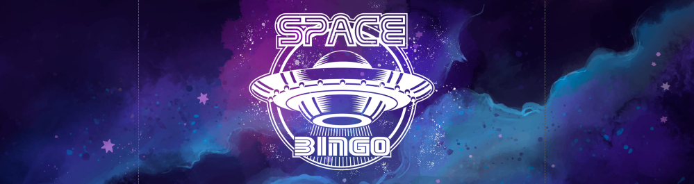
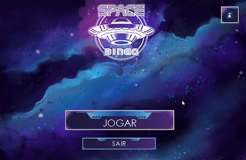

# 🎲 Bingo Game

  

---

## 🏷️ Badges


---

## 📝 Short Description

**Bingo Game** is a Windows Forms application developed as a **personal learning project** to strengthen skills in <i>C# programming, GUI design, and structured project organization</i>. 
Includes **interactive player setup, automatic line and bingo detection, and real-time visual feedback** for the game flow.

**Additional feature:** Click the **<i>"i"</i> icon** in-game to see instructions on how to play.

---

## 🎞️ GIFs / Screenshots

**<h3>1️⃣ Game start & player setup</h3>**  
<p align="left">
  
</p>
<i>Shows the player clicking <b>“Play”</b>, selecting two players, and entering their names</i> (can't play without write the names) <i>before starting the match.</i>
<br></br>

**<h3>2️⃣ Line and Bingo detection</h3>**  
<p align="left">
  
</p> 
<i>Demonstrates the <b>main gameplay</b>: clicking <b>“Generate Number”</b>, the drawn number appears in the center, and matching numbers are marked with stars. Completing a <b>line</b> (horizontal or vertical) is a partial win, and <b>Bingo happens when all numbers are filled</b> - locking the 'Generate button' to end the game.</i>
<br>

---

## 💻 Technologies

- **C#**  
- **.NET Framework 4.7.2**  
- **Windows Forms** (GUI)  
- Visual Studio 2022  

---

## ⚙️ Installation & Usage

**Clone the repository:**
```bash
git clone https://github.com/goncalo-codes/bingo-game.git
```
- Open & Run:

```text
1. Open 'Bingo.sln' in Visual Studio 2022
2. Build the solution (Build > Build Solution)
3. Run the app (Start > Play)
```

---

## 🗂️ Project Structure (summary)

```text
bingo-game/
│
├─ imagens/             # Images used in the project
├─ src/                 # Main project source code
│   ├─ Properties/      # Project properties
│   ├─ References/      # Project references
│   ├─ Program.cs       # Entry point
│   └─ ...              # Other logic files
├─ assets/              # GIFs and screenshots
├─ LICENSE
└─ README.md
```

---

**Author:** Gonçalo Oliveira
